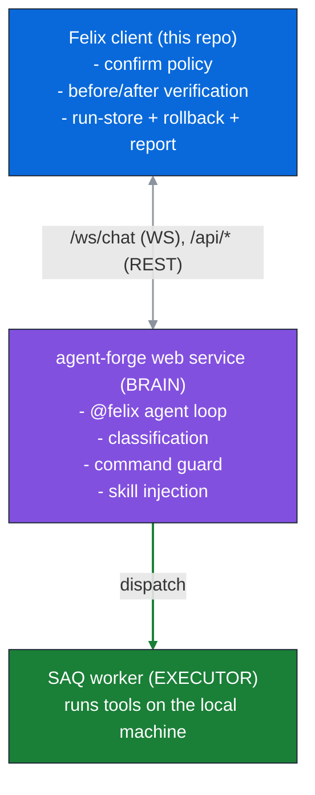

# Architecture

Felix is a thin local client over the [AgentForge](http://localhost:8100) framework.
It owns the policy and the audit trail. AgentForge owns the agent loop and the tool execution.

Three tiers design:

## The three tiers

- **Brain**: the remote agent-forge web service. It runs the agent loop for the `@felix` custom agent: classification, investigation/synthesis, and the server-side `CommandGuard` that gates destructive operations.
- **Executor**: agent-forge dispatches each tool call to a local **SAQ worker** (a launchd job on macOS). This is why Felix, despite talking to AgentForge, can diagnose and repair the *local* box.
- **Felix client** (this repo): drives the run over the `/ws/chat` WebSocket, renders the live event stream, enforces a risk-tiered confirm policy, runs the mandatory before/after verification, and persists a local run-store + rollback + report.

Felix imports nothing from agent-forge. It talks only over REST and the WebSocket. The only server-side coupling is the `@felix` agent definition (see [server-setup.md](server-setup.md)).

## Run lifecycle

A `felix "<prompt>"` run moves through these phases (see `felix/pipeline/orchestrator.py`):

1. **Preflight** (`felix/pipeline/preflight.py`): local scope check. An out-of-scope or under-specified prompt is rejected before any network call, with exit code `2`.
2. **Discovery** (optional, `--discover`): search skills.sh for task-relevant skills, pull + index them so they are retrievable for this run. See [skills.md](skills.md).
3. **Skill retrieval**: the most relevant fleet skills for the prompt are retrieved from the indexer and injected into the run via `overrides._skills`.
4. **Before-probe**: a read-only verification snapshot of the target's current state, via the probe agent.
5. **Investigate + fix**: the `@felix` agent loop runs: read-only diagnostics first, then a proposed fix. Every mutating tool call surfaces as a `confirm.request`, which the client answers through the [confirm policy](safety.md).
6. **Fix enforcement**: if the target was broken and nothing was applied, the orchestrator nudges the agent to apply (or activate) the fix, bounded to a few re-drive attempts.
7. **After-probe**: the same read-only probes re-run; the [verifier](runs-and-reports.md) compares before vs after and decides the verdict.
8. **Report + persist**: the structured report is assembled and the run-store is written under `~/.felix/runs/<timestamp>/`.

## Event stream

AgentForge streams typed events over the WebSocket as the prompt/run proceeds. The client consumes them (`felix/api/events.py`, `felix/api/ws.py`) and reacts:

| Event                        | Client reaction                                           |
|:-----------------------------|:-----------------------------------------------------------|
| `tool.call` / `guard.threat` | classify the risk tier / record the command               |
| `confirm.request`            | run the gate; approve / prompt / deny                     |
| `file.diff`                  | snapshot the pre-change file + `snapshot_id` for rollback |
| `message` / result text      | accumulate the agent narrative for the report             |

Every raw event is also appended to `events.jsonl` in the run-store as a diagnostic trace of what AgentForge actually sent.

## Verdicts

Felix ends every run with exactly one verdict. The agent proposes one. The client's verifier can override it from before/after evidence (it never lets the agent claim FIXED without runtime proof).

- `FIXED`: a change was applied and the problem is verified gone.
- `PARTIAL`: some but not all the problem(s) improved.
- `FAILED`: the applied fix did not resolve the problem.
- `PROPOSED`: diagnosed and a fix proposed, but not applied (e.g., `--read-only`).
- `NOT APPLIED`: nothing changed, including "already healthy, nothing to fix".
- `REJECTED`: the prompt was out of scope (paired with a short refusal only).

See [runs-and-reports.md](runs-and-reports.md) for how the verdict is derived and what the report contains.
