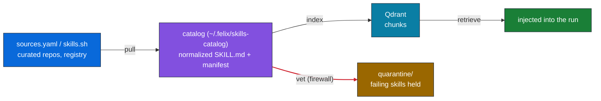

# Skill fleet

Felix's skills catalog does not come from hardcoded files. For each problem it retrieves the most relevant **Agent Skills** (open `SKILL.md` format) and injects
them into the run via `overrides._skills`. A Docker problem pulls Docker know-how, a disk problem pulls disk know-how, etc. Add a new domain by adding skills, not code.



## Anchor skills (always present)

The catalog always includes the bundled system-ops **anchor skills** (`felix/skills/anchors/*.md`), so Felix has core diagnostic know-how regardless
of external sources:

- `docker-diagnostics` — container/compose health, restart loops, logs.
- `disk-pressure` — reclaiming space safely (real data partition vs composefs).
- `service-management` — systemd/service state.
- `network-connectivity` — DNS/port/reachability.
- `http-availability` — endpoint/health checks.
- `safe-remediation` — least-destructive-fix discipline.

## Pull + index

```bash
felix skills pull           # fetch skills listed in felix/skills/sources.yaml -> catalog
felix skills index          # chunk + index the catalog into Qdrant (incremental)
felix skills index --clean  # full wipe + rebuild
felix skills list           # show the acquired catalog + source
```

`pull` reads the curated `felix/skills/sources.yaml` manifest. Each acquired skill is normalized into the catalog and recorded in `_manifest.json` with its source (source repo). Indexing writes chunk JSON to `skills_chunks_dir` (the indexer host must be able to read it) and uploads to the Qdrant-backed search service at `search_base`.

> Indexing embeds server-side and can take minutes for a large catalog. If the client times out, the upload was still submitted — the server keeps embedding in the background. Check progress with `felix skills retrieve "<query>"`.

## Dynamic discovery (skills.sh)

Search the [skills.sh](https://www.skills.sh/) registry and pull skills on demand. Same data as `npx skills`, via its JSON API (no Node needed!).

```bash
felix skills find "kubernetes crashloop"        # search the registry
felix skills add owner/repo@skill --index      # pull a specific skill + index it
felix "why is pod X crashlooping?" --discover  # auto search + pull + index before the run
```

With `skills_auto_discover` on (the default), a run whose local retrieval finds nothing will auto-discover from skills.sh before falling back. `--discover` forces a discovery pass up front.

## Retrieval

```bash
felix skills retrieve "disk is full"   # preview which skills would be injected
```

Retrieval queries the indexer/search service (`search_base`), which is separate from the chat service (`api_base`). It returns up to `skills_top_k` skills above
`skills_score_threshold`; those are injected into the run. A server-side no-clobber merge (`_merge_skills`) ensures Felix's injected fleet is merged with, not overwritten by, the server's keyword resolver.

## Vetting Skills

An acquired skill(s) instruction(s) the agent will follow, so every skill is vetted before it can reach the catalog: a static scan (always on) plus an optional LLM judge. Failing skills are quarantined by default. The full model, the `skills_vetting` modes, and the quarantine/approve workflow are in [safety.md](safety.md#skill-firewall).

```bash
felix skills vet ./SKILL.md             # vet a local skill without acquiring it
felix skills vet owner/repo@skill       # fetch + vet a registry skill, don't catalog it
felix skills quarantine                 # list held skills
felix skills quarantine <name>          # show one skill's findings
felix skills approve <name> --index     # manual override: release into the catalog
```
